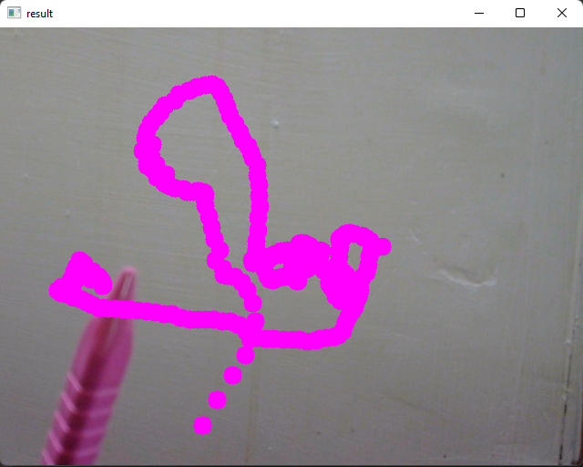

# Virtual-Paint
## Creating a Virtual paint using OpenCV-Python



## Overview

This Virtual Paint application is a Python project that utilizes the OpenCV library to create an interactive paint-like experience using real-time webcam data. The application allows the user to draw by moving an object-of-interest in front of the camera. It's both awesome and challenging to draw simple things using this unique and creative approach.

## Project Description

The Virtual Paint application uses computer vision techniques provided by the OpenCV library to track an object-of-interest based on its pre-defined color. The detected object's movement is then translated into drawing on the screen. The user can draw using different colored lines (Blue, Green, Red, and Yellow) by simply moving the object within the camera's view.

### Video Tracking and Object Detection

The heart of the application is the video tracking algorithm, which analyzes sequential video frames to identify and track the movement of the target object. By localizing and filtering the data, the system accurately tracks the object in real-time.

### Real-World Applications

Video tracking has various practical applications, such as human-computer interaction, security and surveillance, video communication and compression, augmented reality, traffic control, medical imaging, and video editing.

## Execution

To run the Virtual Paint application, execute the following command:
```
python main.py
```


To quit the program, press the 'q' key.

Feel free to try out this exciting Virtual Paint application, and let your creativity flow as you create virtual art using your webcam and simple movements!

---


